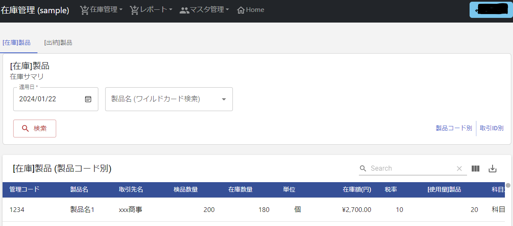
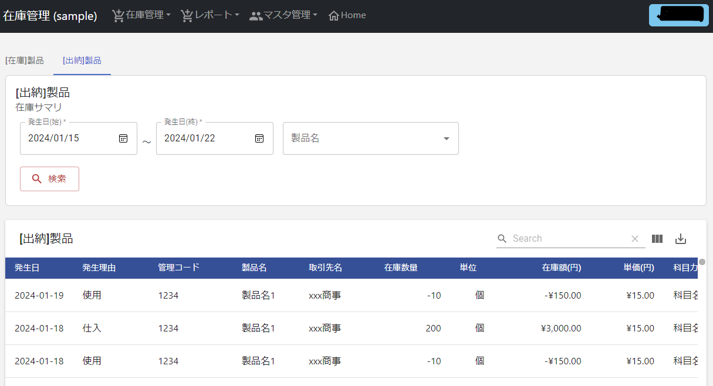

<p align="center">
  <a href="https://npmjs.com/package/vite"></a>
  <a href="https://nodejs.org/en/about/previous-releases"></a>
  <a href="https://vitejs.dev/"></a>
  <a href="https://react.dev/"></a>
  
  
  <a href="https://expressjs.com/ja/"></a>
  <a href="https://sequelize.org/"></a>

</p>


# 在庫管理Web
簡易的な在庫管理(出納)を行うシステムです。
- 現在および指定した日地点の `在庫数量` がサマリ出力されます。 = `在庫表`
- 製品の `仕入` (在庫増加)および `使用` (在庫減少)状況が時系列でサマリ出力されます。 = `出納帳`


# DEMO
* 在庫表

  

* 出納帳

  

# Requirement
## Frontend
- Vite
- React

## Backend
- Express.js
- Sequelize

## DB
- Mariadb

# Auth Provider
- Microsoft Azure AD(Entra)

# Installation
git clone https://github.com/iwataku1129/inventory_management_web_app.git
## Microsoft Azure(Entra) 認証設定
1. `Entra管理センター`内の`アプリの登録`ページから`新規登録`ボタンを押下。
1. `アプリケーションンの登録`ページに従い`登録`。
    リダイレクトURIは`シングルページアプリケーション`、(`https://xxxx.xxx/`)とする。 ※xxxはFrontendサーバドメイン名。
1. `アプリの登録`→2で作成したアプリ名(以降:`[アプリ名]`)→`マニフェスト`タブ内の`"accessTokenAcceptedVersion"`を`2`に変更して保存。
1. `アプリのロール`タブ内にて以下を登録。
    * 許可されたメンバーの種類: `ユーザまたはグループ`
    * 個のアプリロールを有効にしますか？: `✔`

    | 表示名 | 値 | 説明 |
    | --- | --- | --- |
    | `特権` | `Super` | ページの新規作成を行うことが可能です |
    | `管理者` | `Admin` | 自身がアクセス権を持つページにユーザを追加することが可能です。 |
    | `閲覧・登録・更新・削除` | `AllCreateUpdateDelete` | データの登録および削除が可能です |
    | `閲覧・登録・更新` | `AllCreateUpdate` | データの登録が可能です |

1. `APIの公開`タブ内にて以下を登録。
    * アプリケーション ID URI: `api://[アプリケーション(クライアント)ID]`  ※アプリケーション(クライアント)IDは`概要`タブ内で参照可能。
    * `Scope の追加`

        | スコープ名 | 同意できるユーザはだれですか？ | 管理者の同意の表示名 | 管理者の同意の説明 | 有効 | 
        | --- | --- | --- | --- | --- |
        | `access_via_approle_assignments` | `管理者とユーザ` | `access_via_approle_assignments` | Backend API認証用 | 有効 |

1. `APIのアクセス許可`タブ内の`アクセス許可の追加`を押下、
    * `自分のAPI`→`[アプリ名]`→`access_via_approle_assignments`を選択し`アクセス許可の追加`
    * `[xxx に管理者の同意を与えます]`→`はい`を押下。

1. `認証`タブ内の`認証エンドポイントに発行してほしいトークンを選択してください。`にて以下を追加。
    * アクセストークン (暗黙的なフローに使用)
    * IDトークン (暗黙的およびハイブリッドフローに使用)

1. `概要`タブ内の`アプリケーション(クライアント)ID`および、`ディレクトリ (テナント) ID`をメモなどに控える。

    ※FrontendおよびBackendの`.env`ファイル更新時に使用します。

1. `エンタープライズアプリケーション`ページ→`[アプリ名]`→`[ユーザーとグループ]`タブ内の`ユーザまたはグループの追加`ボタンを押下。

    アクセス権を付与するユーザ(またはグループ)およびロールを選択

## Frontend
`.env.development.sample`および`.env.production.sample`を更新。ファイル名の`.sample`を削除して保存。
```bash
cd inventory_management_web_front
npm install
```
https://learn.microsoft.com/ja-jp/entra/identity-platform/tutorial-single-page-app-react-prepare-spa?tabs=visual-studio
## Backend
`.env.sample`を更新。ファイル名の`.sample`を削除して保存。
```bash
cd inventory_management_web_back
npm install
```

# Usage
## Frontend
```bash
cd inventory_management_web_front
npm run dev
```

## Backend
```bash
cd inventory_management_web_back
npm start
```


# Note


# Author
* T.iwai (https://github.com/iwataku1129)

# License
"inventory_management_web_app" is under [MIT license](https://en.wikipedia.org/wiki/MIT_License).
